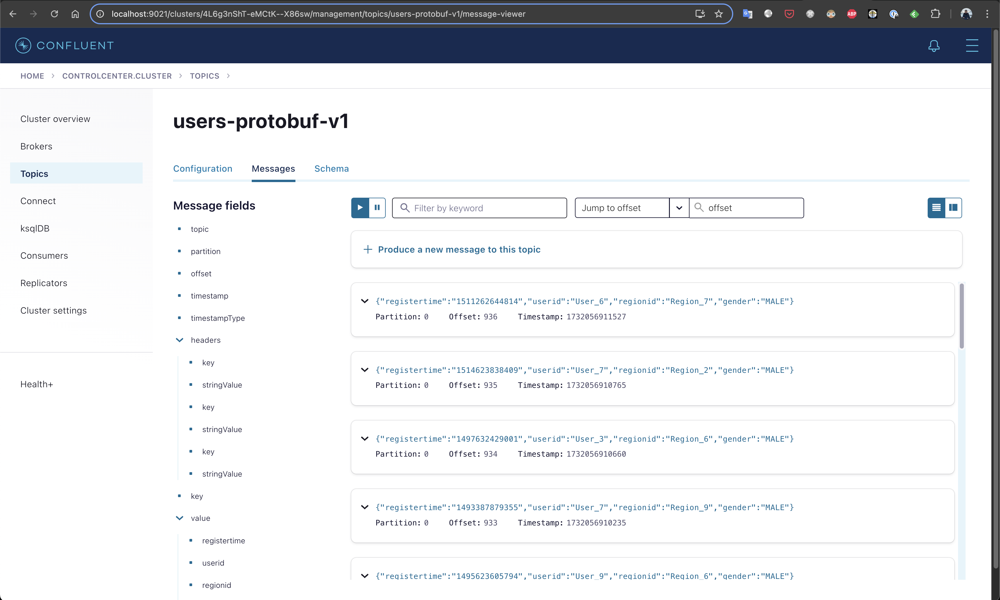
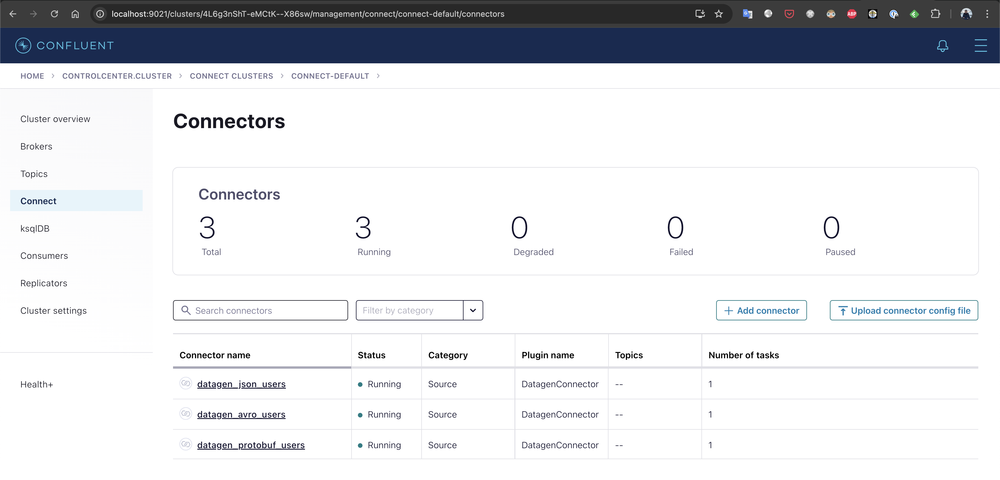

# Kafka Quick POC Setup

Whenever I wanted to do a quick POC with Kafka, I was spending an hour spinning up a Kafka broker with sample data. To address that, I created this Docker Compose setup so you can spin up a Kafka environment with sample data by simply running `docker compose up`.

This setup includes the following components:

1. **Kafka Broker**: The core messaging system.
2. **Schema Registry**: To manage Avro, Protobuf, and JSON schemas.
3. **Kafka Connect**: Includes a pre-configured `DataGen` connector to generate sample data.
4. **Kafka Control Center**: For managing and monitoring your Kafka cluster.

## Features

- **Quick Setup**: Bring up the entire Kafka environment in seconds.
- **Sample Data Generation**: Automatically generate sample data using the DataGen connector with JSON, Avro, and Protobuf formats.
- **Schema Support**: Full support for Avro, Protobuf, and JSON schemas via the Schema Registry.
- **Easy Monitoring**: Monitor topics, consumer groups, and more using the Kafka Control Center.


---

## Requirements

- **Docker** and **Docker Compose** must be installed on your machine.

---

## Getting Started

1. Clone this repository:
    
    ```bash
    git clone git@github.com:farbodahm/kafka-with-sample-data.git
    cd kafka-with-sample-data
    ```
    
2. Start the environment:
    
    ```bash
    docker compose up
    ```
    
3. Access Kafka Control Center:
    - Open your browser and go to `http://localhost:9021`
    - Start the connector you want. This compose  will create 3 connectors for you:
      - User sample data with Json schema
      - User sample data with Avro schema
      - User sample data with Protobuf schema
       
4. View and manage the generated data:
    - Data will be generated on predefined topics by the DataGen connector.
    - Check the topics in Kafka Control Center or using Kafka CLI tools.

---

## Components Overview

### Kafka Broker

- **Port**: `9092`
- Central messaging system.

### Schema Registry

- **Port**: `8081`
- Used for managing and storing schemas.

### Kafka Connect

- **Port**: `8083`
- Includes the `DataGen` connector to generate sample data.

### Kafka Control Center

- **Port**: `9021`
- GUI for managing and monitoring Kafka clusters.

---

## Pre-configured Topics and Sample Data

The default `DataGen` connector generates sample data for the following topics:

1. **JSON Topic**: Sample User data in JSON format.
2. **Avro Topic**: Sample User data in Avro format.
3. **Protobuf Topic**: Sample User data in Protobuf format.

These topics are pre-configured in the Kafka Connect setup.

An example of generated data looks like:
```json
{
  "registertime": "1491454553823",
  "userid": "User_6",
  "regionid": "Region_1",
  "gender": "OTHER"
}
```
---

## Customization

You can customize the setup by modifying the `docker-compose.yml` file and related connector configurations under `config` module:

**Connector Configuration**: Update the DataGen connector configurations to generate data matching your POC requirements.

- You can either use predefined schemas [here](https://github.com/confluentinc/kafka-connect-datagen/tree/master/config).
- Or add you own schema to generate sample data based on your requirements following [here](https://github.com/confluentinc/kafka-connect-datagen/tree/master/config).

Then you can easily add a new connector via:
```bash
curl -X POST -H "Content-Type: application/json" --data @config/NEW_CONFIG.json http://localhost:8083/connectors
```

---

## Stopping the Setup

To stop the Kafka environment, run:

```bash
docker compose down
```

---

## Troubleshooting

If you encounter issues, check the logs of individual services:

```bash
docker logs <container-name>
```

---
